# Projeto Fullstack: Projeto integrador transdiciplinar 2


Este projeto tem como objetivo desenvolver um sistema de e-commerce de uma loja de cupcakes para a gestão de compra do produto, cadastro e login de usuário. A plataforma permite que os clientesse registrem, adicionem seus pedidos ao carrinho e procedam ao pagamento por meio da plataforma Stripe.

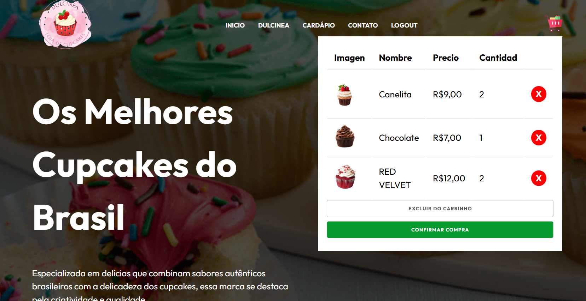

# Utils
- Wireframe: 
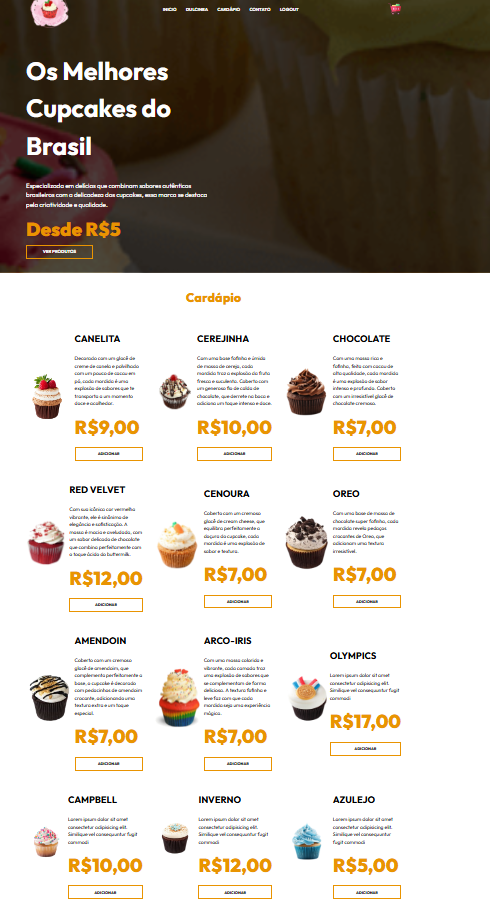
- História de usuários: 
)
- Diagrama de banco de dados: 
)
- Diagrama de Sequencia: 
) 
- Diagrama de caso de uso: 
) 

## Pré-requisitos
- Php
- XAMPP
- Node.js e npm
- Javascript
- MySQL
- HTML
- CSS

# Configuração do Projeto

1. Fork ou clone o repositório: `https://github.com/lyberrios/pit2ErmarlyBerrios`

2. Baixe o Painel de Controle do XAMPP 

Se você quiser testar o site antes de colocar em um hosting para executar servidores e bancos de dados MySQL 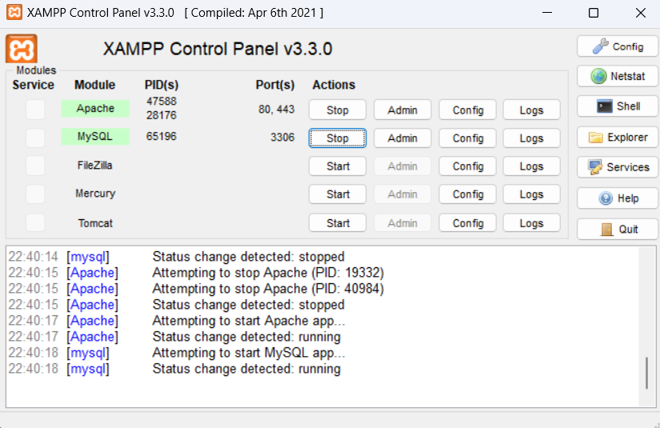

### Passos para criar o banco e configurar o projeto:
1. Abra o Php Myadmin e certifique-se de que o serviço MySQL está rodando corretamente: http://localhost/phpmyadmin/

2. Utilize o script SQL do repositório para gerar as tabelas e o usuário padrão:

- Crie uma nova base de dados com o nome do seu negócio
- Certifique-se de que tenha selecionado ou adicionado o tipo "InnoDB" no seu banco de dados.

- Depois crie uma tabela para adicionar os dados dos usuários que vão a se cadastrar 
- Tente adicionar usuarios de prova para certificar-se de que tudo está dando certo
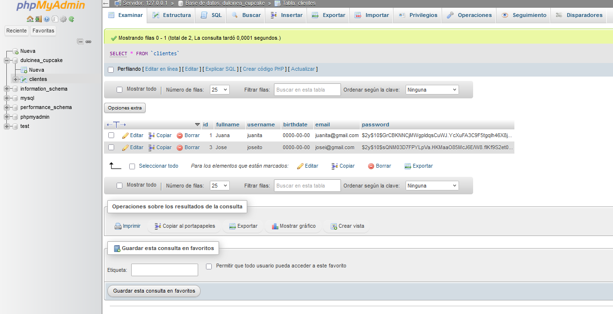
- Certifique-se de fazer hash das senhas dos usuários para manter seus dados seguros. Você pode usar a função `password_hash` do PHP para fazer isso da seguinte maneira:

```php
$password = password_hash($_POST['password'] ?? '', PASSWORD_DEFAULT);
```
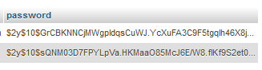

# Sistema de Autenticação
Este sistema de autenticação permite que os usuários se cadastrem na plataforma, façam login e acessem um Dashboard personalizado para que o usuario preencha os seus dados pessoais para fazer seu pedido após a autenticação. Os principais processos envolvidos são explicados a seguir: Cadastro (Cadastro), Login e Dashboard.
3. Processo de Cadastro
### Fluxo Cadastral - Formulário de Cadastro:
O usuário acessa a página de cadastro onde é solicitado o preenchimento de diversos campos:
- Nome completo
- Nome de usuário
- Data de nascimento
- E-mail
- Senha
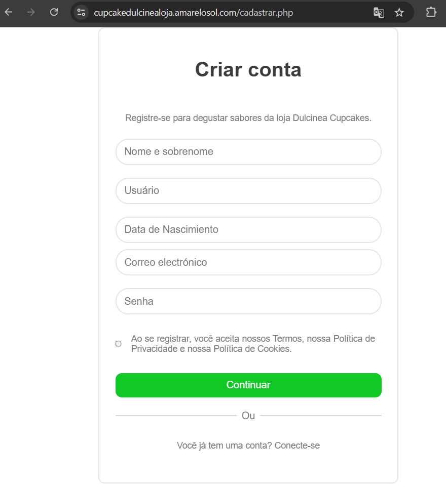

### Validação de dados:
No lado do cliente, os dados são validados usando JavaScript para garantir que todos os campos obrigatórios estejam preenchidos e que o email esteja em um formato válido.
No lado do servidor, são realizadas verificações adicionais para garantir que o nome de usuário ou e-mail ainda não esteja em uso.

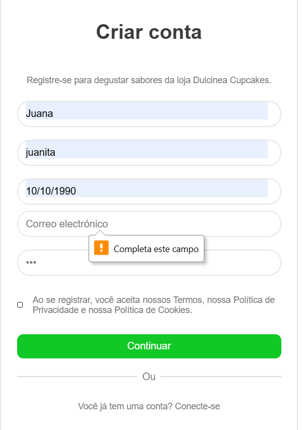
### Confirmação de inscrição:
Caso o cadastro seja bem-sucedido, o usuário é redirecionado para uma página de sucesso, onde é informado que pode efetuar login.

4. Processo de login
O processo de login permite que os usuários acessem a plataforma com suas credenciais cadastradas.
### Formulário de login:
O usuário insere seu nome de usuário ou e-mail e senha no formulário de login.
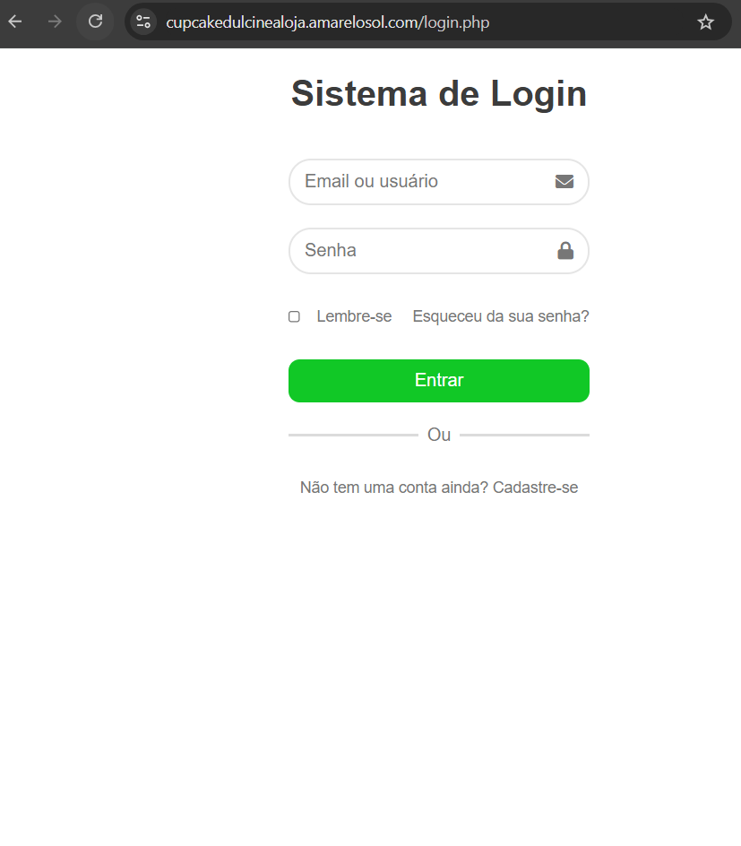
### Verificação de credenciais:
O servidor procura o usuário no banco de dados usando o nome de usuário ou e-mail fornecido.

A senha inserida é comparada com aquela armazenada no banco de dados usando 
```
password_verify.
```
### Autenticação:
``` 
// Verificar a senha
if (password_verify($password_ingresado, $password_almacenado)) {
    $_SESSION['user_id'] = $user['id'];
    $_SESSION['username'] = $user['username'];
    header("Location: dashboard.php");
} else {
    echo "Senha incorreta.";
}
```

Se as credenciais estiverem corretas, uma sessão é iniciada e o usuário é redirecionado para o Dashboard.
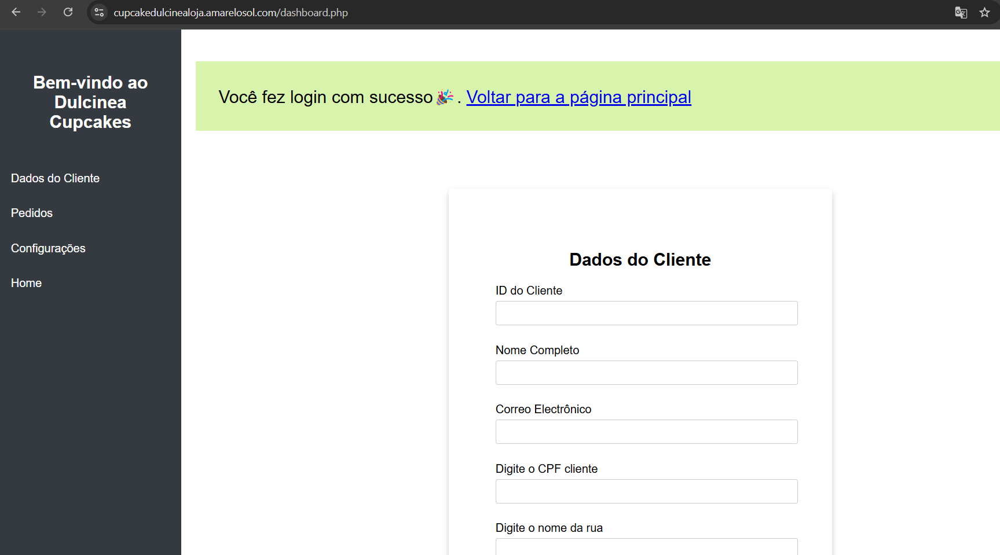

Se as credenciais estiverem incorretas, será exibida uma mensagem de erro informando que os dados estão incorretos.
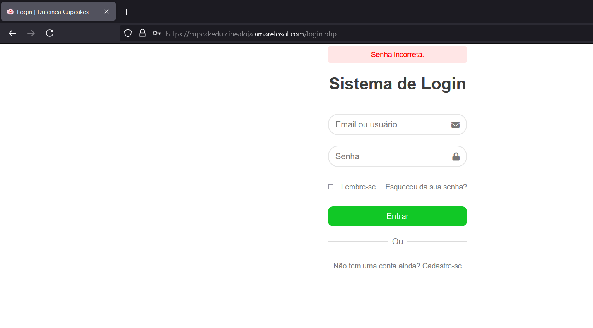
5. Dashboard
O Dashboard é a página principal para a qual o usuário é redirecionado após fazer login. Neste painel o usuário pode acessar seus dados pessoais e funções exclusivas de sua conta.

### Recursos do painel
- Informações pessoais
- Visualizando detalhes do usuário, como nome, e-mail e data de nascimento, dados de endereço, cpf
- O usuário pode gerenciar suas informações pessoais
- Ver pedidos
- Voltar ao site principal

6. Processo de check-out
Este projeto implementa um processo de checkout usando Stripe para gerenciar pagamentos com segurança. O usuário pode selecionar produtos, inserir seus dados de pagamento e finalizar a transação.

7. Integração de pagamentos com Stripe
- Para processar pagamentos, é recomendado usar a API Stripe. Siga estas etapas para integrá-lo ao seu projeto:
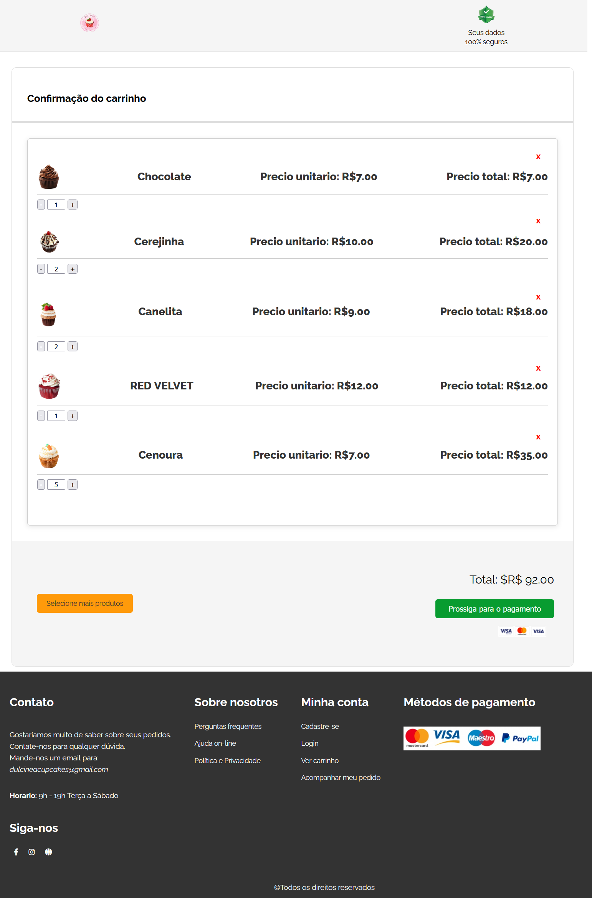

### a. Crear una cuenta en Stripe
Visite [Stripe](https://stripe.com) e crie uma conta, caso ainda não tenha uma.

### b. Instale a biblioteca Stripe
Se estiver usando PHP, você pode instalar a biblioteca Stripe usando o Composer:
```bash
composer require stripe/stripe-php
```
### c. Faça a configuração de Stripe
```
\Stripe\Stripe::setApiKey('publishable_ key_aqui') --> arquivo de javascript

\Stripe\Stripe::setApiKey('secret_ key_aqui') --> arquivo para pagamento feito em php
```
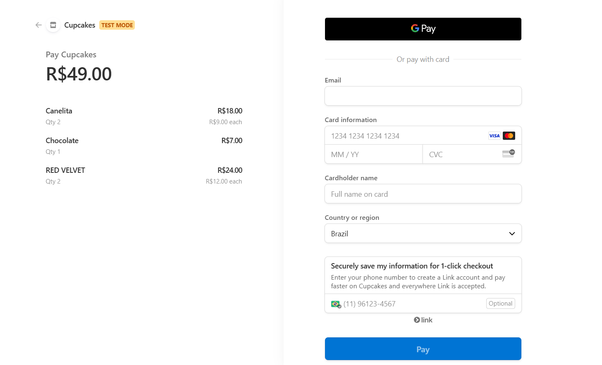

8. ## Cancelação do pedido
A funcionalidade de "Cancelamento do Pedido" foi implementada para fornecer aos usuários uma experiência amigável e intuitiva ao lidar com pagamentos que não foram bem-sucedidos ou que foram cancelados. A página de cancelamento (cancel.php) é exibida ao usuário quando ocorre um problema durante o processo de checkout, seja por falha no pagamento ou por escolha do próprio usuário em cancelar a transação.

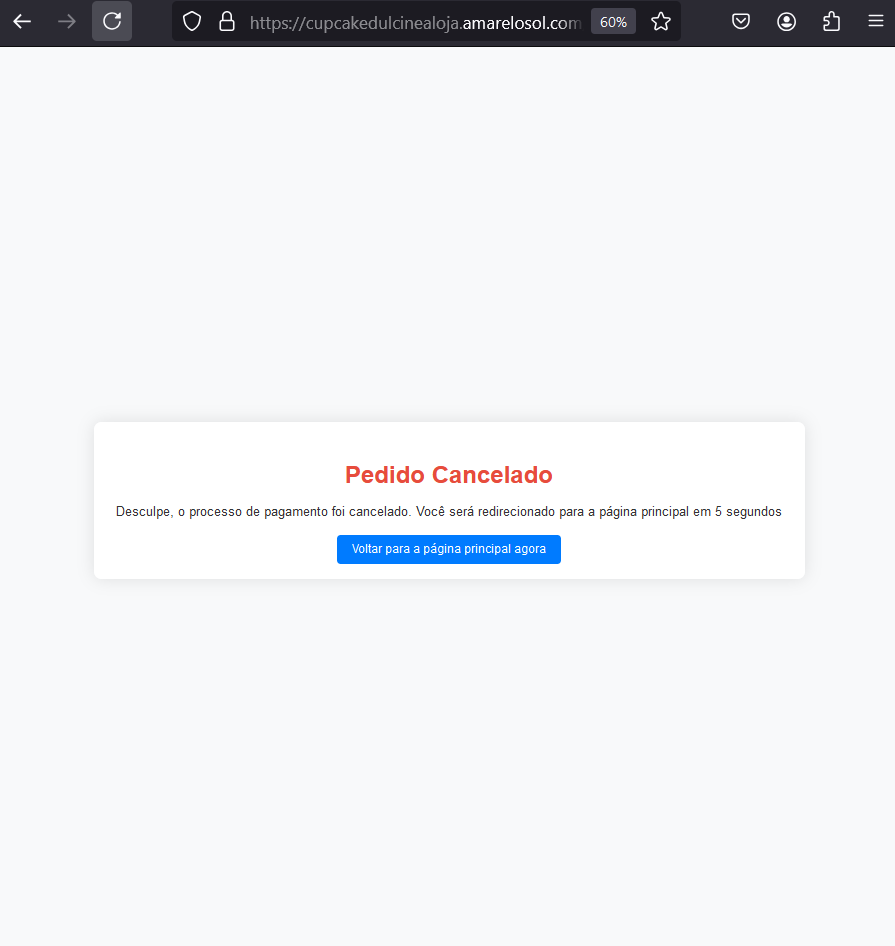
