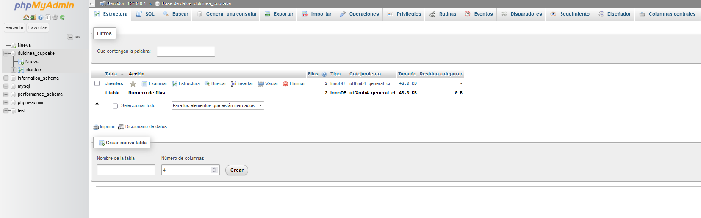

# Projeto Fullstack: Projeto integrador transdiciplinar 2


Este projeto tem como objetivo desenvolver um sistema de e-commerce de uma loja de cupcakes para a gestão de compra do produto, cadastro e login de usuário. A plataforma permite que os clientesse registrem, adicionem seus pedidos ao carrinho e procedam ao pagamento por meio da plataforma Stripe.


# Utils
- Wireframe: 

- História de usuários: 
)
- Diagrama de banco de dados: 
)
- Diagrama de Sequencia: 
) 
- Diagrama de caso de uso: 
) 

## Pré-requisitos
- Php
- XAMPP
- Node.js e npm
- Javascript
- MySQL
- HTML
- CSS

# Configuração do Projeto

1. Fork ou clone o repositório: `https://github.com/lyberrios/pit2ErmarlyBerrios`

2. Baixe o Painel de Controle do XAMPP 

Se você quiser testar o site antes de colocar em um hosting para executar servidores e bancos de dados MySQL 

### Passos para criar o banco e configurar o projeto:
1. Abra o Php Myadmin e certifique-se de que o serviço MySQL está rodando corretamente: http://localhost/phpmyadmin/

2. Utilize o script SQL do repositório para gerar as tabelas e o usuário padrão:

- Crie uma nova base de dados com o nome do seu negócio
- Certifique-se de que tenha selecionado ou adicionado o tipo "InnoDB" no seu banco de dados.

- Depois crie uma tabela para adicionar os dados dos usuários que vão a se cadastrar 
- Tente adicionar usuarios de prova para certificar-se de que tudo está dando certo

- Certifique-se de fazer hash das senhas dos usuários para manter seus dados seguros. Você pode usar a função `password_hash` do PHP para fazer isso da seguinte maneira:

```php
$password = password_hash($_POST['password'] ?? '', PASSWORD_DEFAULT);
```


3. # Processo de check-out
Este projeto implementa um processo de checkout usando Stripe para gerenciar pagamentos com segurança. O usuário pode selecionar produtos, inserir seus dados de pagamento e finalizar a transação.

4. Integração de pagamentos com Stripe
- Para processar pagamentos, é recomendado usar a API Stripe. Siga estas etapas para integrá-lo ao seu projeto:


### 1. Crear una cuenta en Stripe
Visite [Stripe](https://stripe.com) e crie uma conta, caso ainda não tenha uma.

### 2. Instale a biblioteca Stripe
Se estiver usando PHP, você pode instalar a biblioteca Stripe usando o Composer:
```bash
composer require stripe/stripe-php```

### 3. Faça a configuração de Stripe
\Stripe\Stripe::setApiKey('chave_ publica_aqui') --> arquivo de javascript

\Stripe\Stripe::setApiKey('chave_ secreta_aqui') --> arquivo para pagamento feito em php


